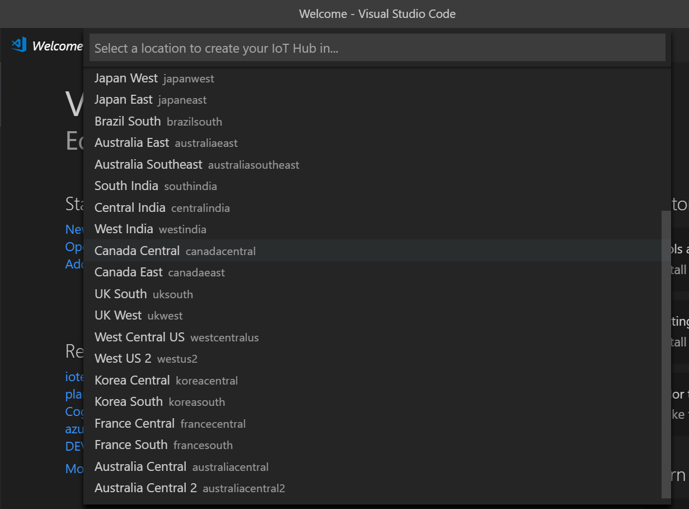
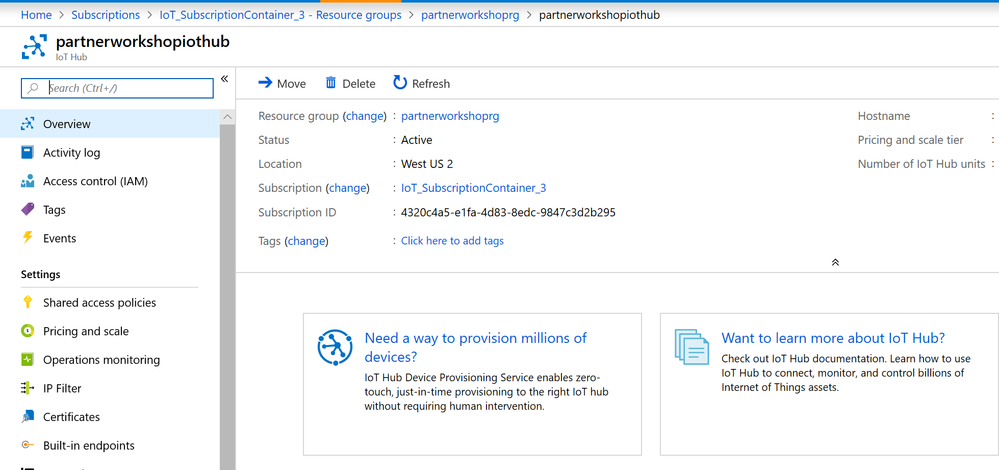

# Create Azure IoT Hub using Visual Studio Code

## Overview

**Azure IoT Hub** is the core Azure PaaS. IoT Hub enables reliable and securely bidirectional communications between millions of IoT devices and a cloud solution. IoT Hub helps you meet IoT implementation challenges such as:

* High-volume device connectivity and management.
* High-volume telemetry ingestion.
* Command and control of devices.
* Device security enforcement.

### Install Visual Studio Code Editor

If you have not installed VSCode, Click [here](https://code.visualstudio.com/) and download the IDE based on your machine OS. macOS, Windows and Linux are supported.

Open VSCode Editor.

## VSCode IoT Extensions

Install **Azure IoT Tools** VSCode Extension - The ultimate collection of extensions for working with Azure IoT in VS Code. 


**Azure IoT Tools** Extension will install 3x extensions. This means you will not have to install each of the following extensions individually. 

1. **Azure IoT Edge Tools** makes it easy to code, build, deploy, and debug your IoT Edge solutions.

    * Create new Azure IoT Edge project
    * Add new IoT Edge module (C#) to solution
    * Edit, build, run, and debug IoT Edge modules locally on your machine
    * Build and publish IoT Edge module Docker images
    * Manage IoT Edge devices and modules in IoT Hub (with Cloud Explorer)
    * Deploy IoT solutions to IoT Edge devices

2. **Azure IoT Toolkit** helps with Interact with Azure IoT Hub, IoT Device Management, IoT Edge Management and IoT Hub Code Generation.

    * IoT Hub Management
    * Device Management
    * Edge Module Management
    * Interact with IoT Hub
    * Interact with IoT Edge

3. **Azure IoT Workbench**, the IoT Workbench extension makes it easy to code, build, deploy and debug your IoT project with multiple Azure services and popular IoT development boards. IoT Workbench aims to support multiple popular IoT development boards and kits. It currently supports following IoT hardware:
    * MXChip IoT DevKit
    * teXXmo IoT button
    * Raspberry Pi
    * ESP32

### Sign-in to Azure

```editor
Press (Control + Shift + P) in VSCode editor or hit F1
Enter >Azure:Sign in to Azure Cloud
```

Select Sign In to Azure Cloud


Select Your Azure Cloud


If you have not signed-in into Azure from VSCode you will be presented with a dialog to sign in to Azure.


A browser URL and code will be provided. Click **Copy**, go to browser and type URL: http://microsoft.com/devicelogin and paste the code in the browser. You will be asked to sign in with your Azure credentials.

### Create IoT Hub Instance

Sign in to Azure. 


Once successfully signed-in to Azure 

1. Create IoT Hub 

```editor
Press (Control + Shift + P) in VSCode editor or hit F1
Enter >Azure IoT Hub: Create IoT Hub
```


2. Select the subscription you would like to use for this lab.


   
3. Create a resource group or select an existing resource group.


 
4. Select the region in which you would like to create the IoT Hub



5. Select Pricing and scale tier. For this lab you can select a **Standard** Tier (S1).
   
6. Provide a name to your IoT Hub. Make sure its a unique name. Try to qualify with your initials

An IoT Hub will be created for you.


Go To Azure portal to verify IoT Hub creation



 Continue on to the next part of the lab: [Module 3: Deploy Azure IoT Edge Enabled Linux VM](https://hellotechie.github.io/azureiotedgelab/marketplacedeployment/)
