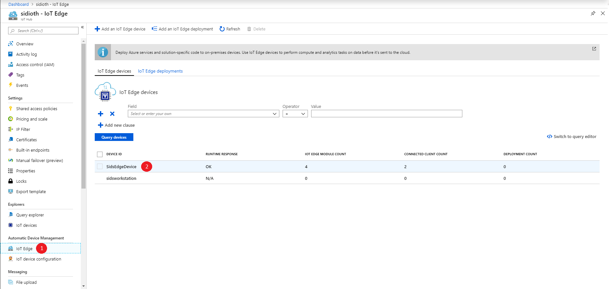
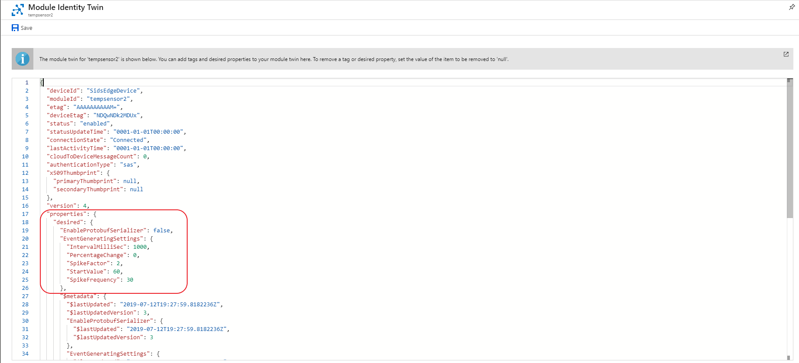
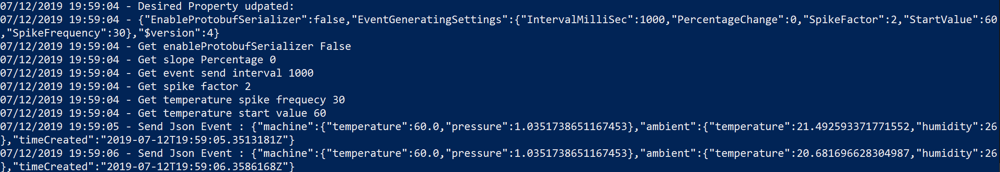
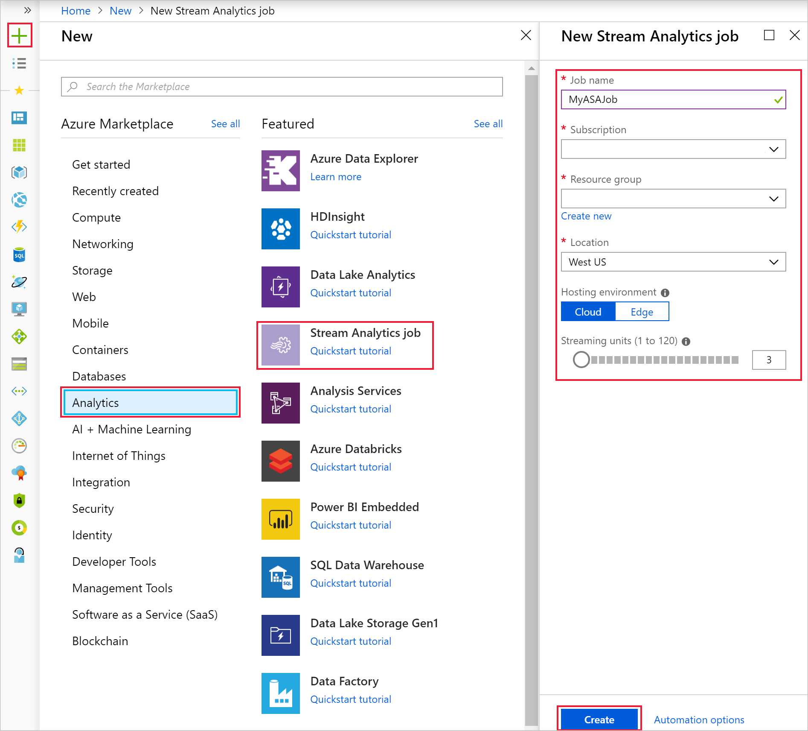
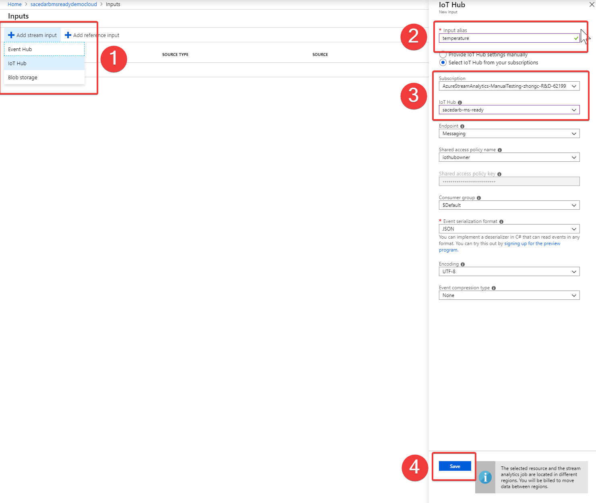
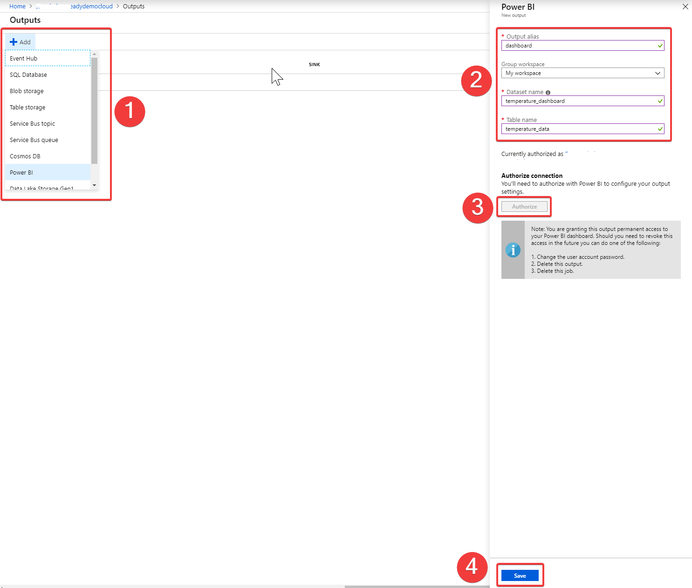
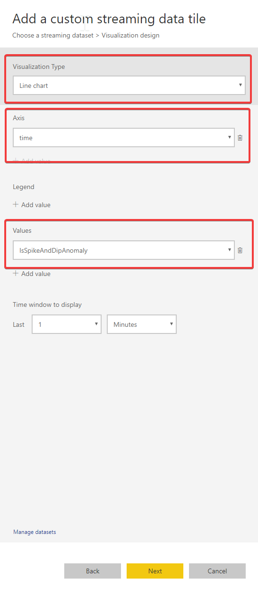
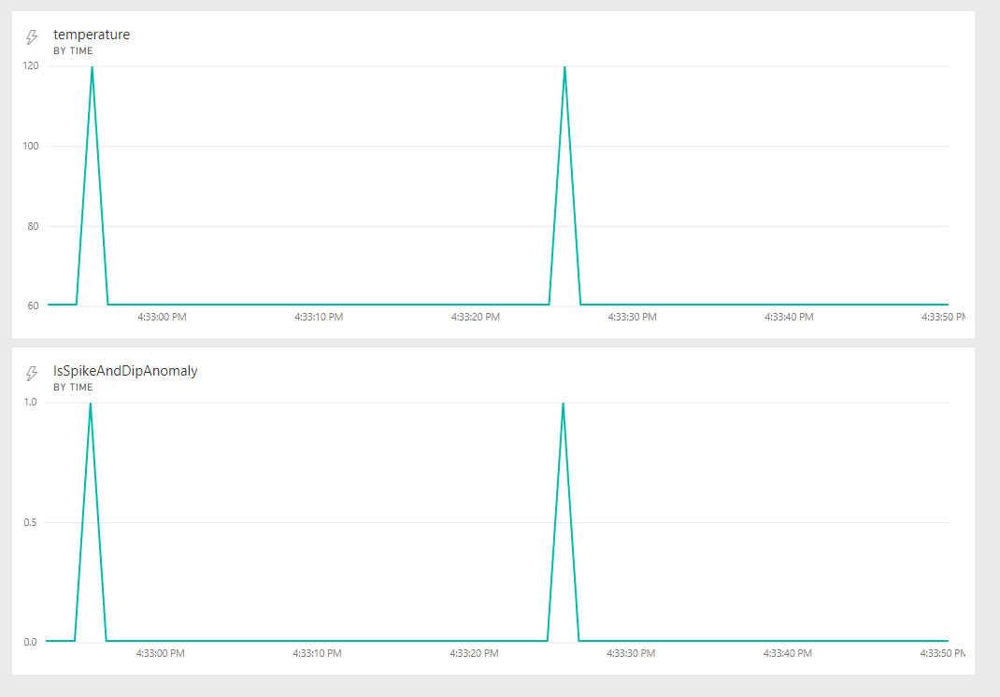

# Detect anomalies with Azure Stream Analytics job running in the cloud

One of the advantages of using Azure Stream Analytics is that you can run the same analytics logic on both the edge and the cloud. In the cloud environment, your streaming job can run at massive scale and also easily egress data to other Azure services.

In this section you will learn how to detect anomalies in temperature values coming from the temperature sensor module from the previous section. You will be creating a Stream Analytics job in the cloud that will do the anomaly detection and send the output to a [Power BI](https://powerbi.microsoft.com) dashboard where you can visualize the results in real-time.

## Configure temperature sensor to generate anomalous events

Before setting up the Stream Analytics job, the simulated IoT device needs to be configured to generate anomalous data. The below steps will update the sensor to send a large temperature spike every 30 seconds.

1. Sign in to the [Azure portal](https://portal.azure.com).

2. Go to the IoT Hub you created in the previous section. Then select your IoT Edge device to see the list of deployed modules.

   

3. Select *tempsensor* module from that list and then click on **Module Identity Twin** on the top.

4. Update desired properties to the following values and then click **Save**.

    ```json
    "EventGeneratingSettings": {
        "IntervalMilliSec": 500,
        "PercentageChange": 0,
        "SpikeFactor": 2,
        "StartValue": 5,
        "SpikeFrequency": 20
      }
   ```

   

5. You can see this reflected in the Edge module by looking at the logs. Your temperature sensor is now generating anomalous events.

    ```shell
    iotedge logs tempsensor -f --tail 200
    ```

   

## Create a Stream Analytics job

1. Sign in to the [Azure portal](https://portal.azure.com).

2. Select **Create a resource** in the upper left-hand corner of the Azure portal.

3. Select **Analytics** > **Stream Analytics job** from the results list.

4. Fill out the Stream Analytics job page with the following information:

   | **Setting**         | **Suggested value**                        | **Description**                                                                                                                                                                                       |
   |---------------------|--------------------------------------------|-------------------------------------------------------------------------------------------------------------------------------------------------------------------------------------------------------|
   | Job name            | MyASAJob                                   | Enter a name to identify your Stream Analytics job. The Stream Analytics job name can contain alphanumeric characters, hyphens, and underscores only and it must be between 3 and 63 characters long. |
   | Subscription        | \<Your subscription\>                      | Select the Azure subscription that you want to use for this job.                                                                                                                                      |
   | Resource group      | \<Your resource group\>                    | Select the same resource group as your IoT Hub.                                                                                                                                                       |
   | Location            | \<Select the same region as your IoT Hub\> | Select the geographic location where you can host your Stream Analytics job. Use the location that's closest to your users for better performance and to reduce the data transfer cost.               |
   | Streaming units     | 1                                          | Streaming units (SU) is an abstraction for the amount of compute and memory allocated for your job. More SUs will allow your job to process more events.                                              |
   | Hosting environment | Cloud                                      | Stream Analytics jobs can be deployed to the cloud or edge. Cloud allows you to deploy to Azure Cloud, and Edge allows you to deploy to an IoT Edge device.                                           |

   

5. Check the **Pin to dashboard** box to place your job on your dashboard and then select **Create**.

6. You should see a *Deployment in progress...* notification displayed in the top right of your browser window. When the deployment finishes, you can navigate to the Stream Analytics job.

## Configure job input

In this section, you will configure an IoT Hub device input to the Stream Analytics job. Use the IoT Hub you created in the previous section.

1. Navigate to your Stream Analytics job.

2. Select **Inputs** > **Add Stream input** > **IoT Hub**.

3. Fill out the **IoT Hub** page with the following values:

   | **Setting**  | **Suggested value**                    | **Description**                                                                                                                                                                                                                     |
   |--------------|----------------------------------------|-------------------------------------------------------------------------------------------------------------------------------------------------------------------------------------------------------------------------------------|
   | Input alias  | temperature                            | Enter a name to identify the job’s input.                                                                                                                                                                                           |
   | Subscription | \<Your subscription\>                  | Select the Azure subscription that has the storage account you created. The storage account can be in the same or in a different subscription. This example assumes that you have created storage account in the same subscription. |
   | IoT Hub      | \<Your IoT Hub from previous section\> | This is the IoT Hub you created earlier and is receiving data from the Edge device (temperature module)                                                                                                                             |

   

4. Leave other options as their default values and select **Save** to save the settings.

## Configure job output

In this section, you will add an output sink to the Stream Analytics job. Stream Analytics supports many different output sinks, including Azure SQL, Blob storage, Cosmos DB, and Power BI.

1. Navigate to your Stream Analytics job.

2. Select **Outputs** > **+ Add** > **Power BI**.

3. Fill the form with the following details and select **Authorize**:

   | **Setting**  | **Suggested value**   |
   |--------------|-----------------------|
   | Output alias | dashboard             |
   | Dataset name | temperature_dashboard |
   | Table name   | temperature_data      |

   

4. When you select **Authorize**, a pop-up window opens and you are asked to provide credentials to authenticate to your Power BI account. Once the authorization is successful, **Save** the settings.

## Implement Anomaly Detection logic in ASA query

1. Navigate to the Stream Analytics job that you created earlier.

2. Select **Query** and update the query as follows:

   ```sql
   WITH AnomalyDetectionStep AS
    (
      SELECT
      timeCreated AS time,
      CAST(machine.temperature AS float) AS temperature,
      AnomalyDetection_SpikeAndDip(CAST(machine.temperature AS float), 95, 40, 'spikesanddips')
          OVER(LIMIT DURATION(second, 40)) AS SpikeAndDipScores
      FROM
      temperature TIMESTAMP BY timeCreated
    )

    SELECT
    time,
    temperature,
    CAST(GetRecordPropertyValue(SpikeAndDipScores, 'Score') AS float) AS SpikeAndDipScore,
    CAST(GetRecordPropertyValue(SpikeAndDipScores, 'IsAnomaly') AS bigint) AS IsSpikeAndDipAnomaly
    INTO dashboard
    FROM AnomalyDetectionStep
   ```

3. The query reads the data stream from IoT Hub and identifies anomalies in temperature values and sends the results to a Power BI dataset. This dataset can then be used to create visualizations in Power BI to see anomalies in real-time.

## Start the job and visualize output

1. To start the job, navigate to the **Overview** pane of your job and select **Start**.

2. Select **Now** for job output start time and select **Start**. You can view the job status in the notification bar.

3. Once the job is running, navigate to [Power BI](https://powerbi.com/) and sign in with your account that you used to authenticate when adding the Power BI output to Stream Analytics. If the Stream Analytics job query is outputting results, the *temperature_dashboard* dataset you created will appear under the **Datasets** tab.

4. From your Power BI workspace, select **+ Create** to create a new dashboard named *Anomaly Detection*.

5. At the top of the window, select **Add tile**. Then select **Custom Streaming Data** and **Next**. Choose the **temperature_dashboard** under **Your Datasets**. Select **Line Chart** from the **Visualization type** dropdown. Then choose **time** for *Axis* and **temperature** for *Values*. Select **Next** to enter a name for the tile, and then select **Apply** to create the tile.

6. Follow the step 5 again with the following options:

   * When you get to Visualization Type, select Line chart.
   * Add an axis and select **time**.
   * Add a value and select **IsSpikeAndDipAnomaly**.

   

7. Your dashboard should look like the example below once both tiles are added. Your Power BI dashboard periodically updates as new data arrives. Note that you can resize the tiles by clicking and dragging from their corners.

   

## Clean up resources

When no longer needed, delete the resource group, the Stream Analytics job, and all related resources. Deleting the job avoids billing the streaming units consumed by the job. If you're planning to use the job in future, you can stop it and restart it later when you need. If you are not going to continue to use this job, delete all resources created by using the following steps:

1. From the left-hand menu in the Azure portal, select **Resource groups** and then select the name of the resource group you created.

2. On your resource group page, select **Delete**, type the name of the resource group to delete in the text box, and then select **Delete**.
