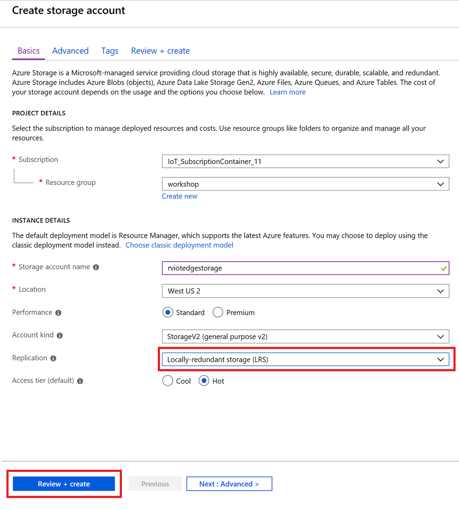
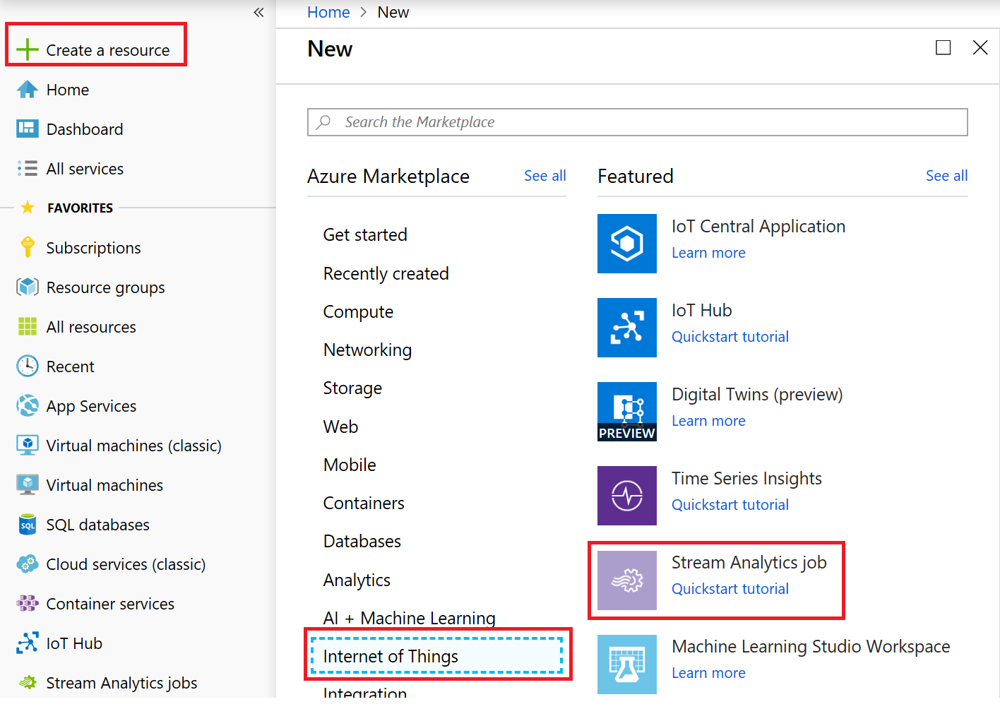
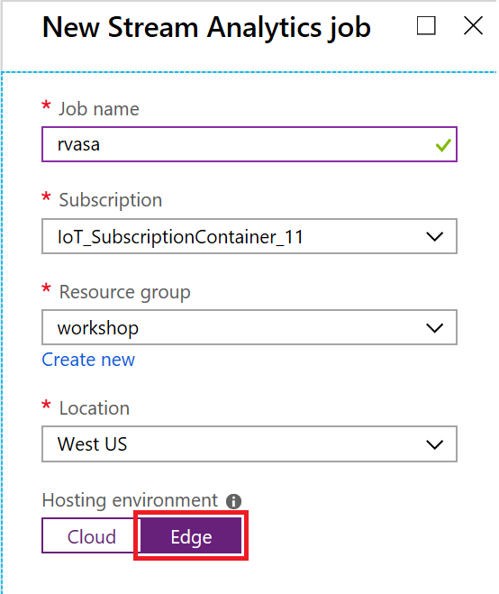
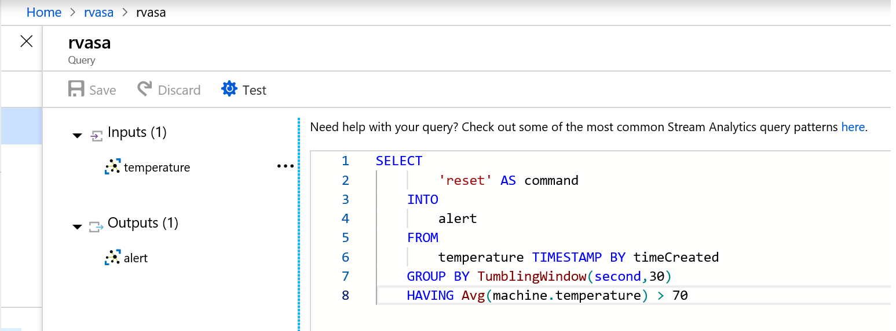
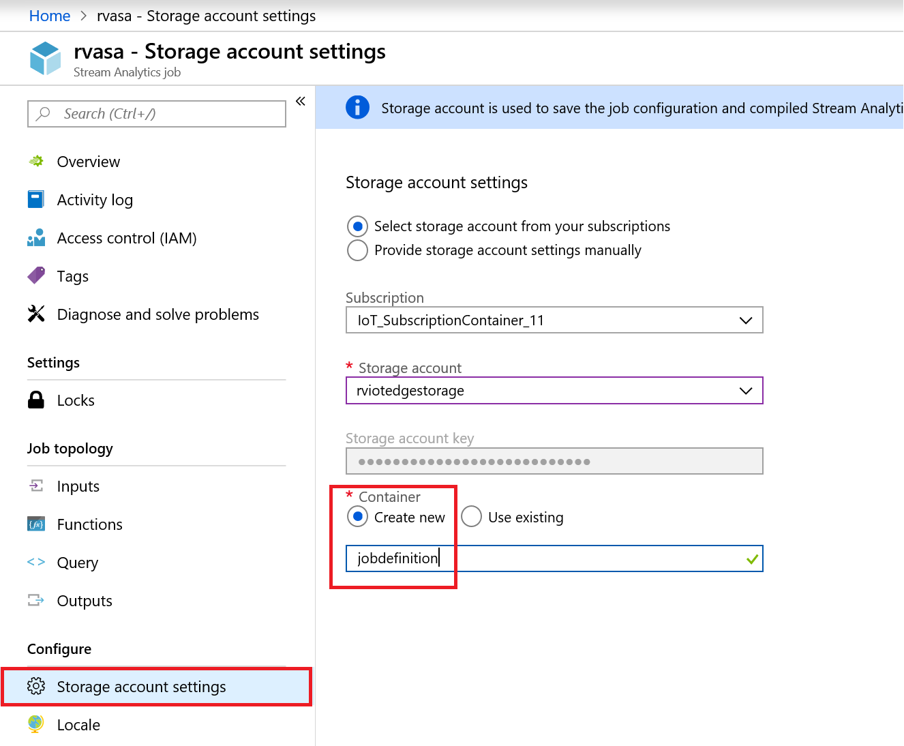
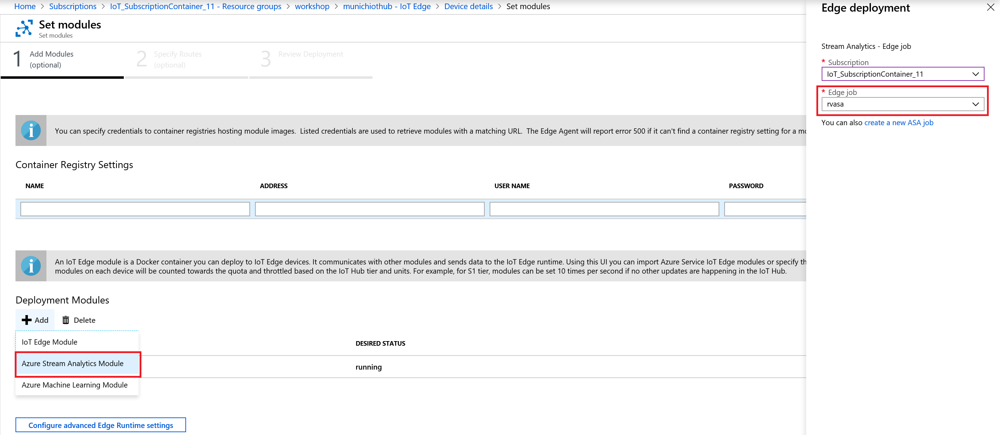
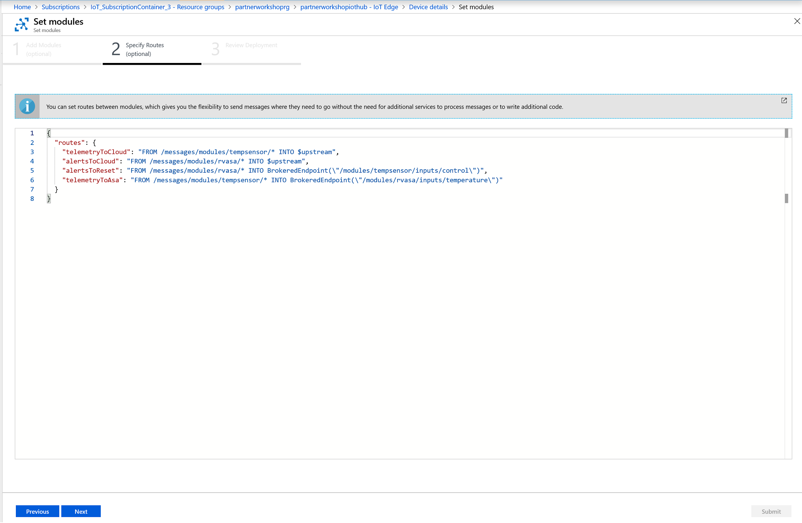
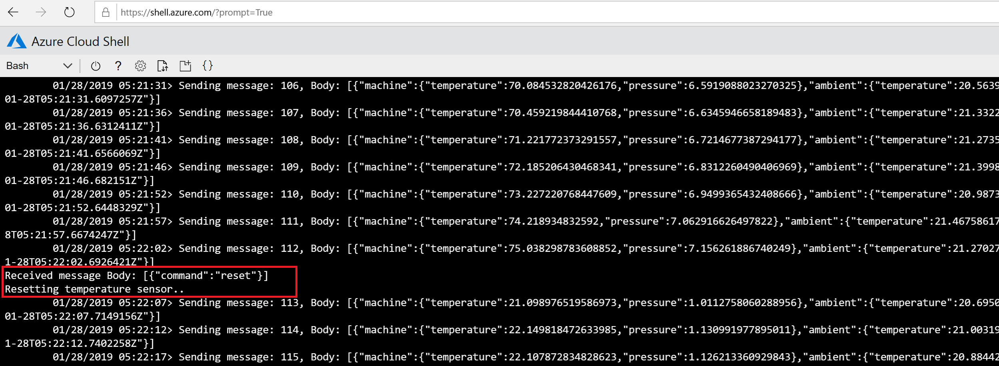

## Deploy Azure Stream Analytics as an IoT Edge module

### Overview

Azure IoT Edge and Azure Stream Analytics are integrated so that you can create an Azure Stream Analytics job in the Azure portal and then deploy it as an IoT Edge module with no additional code.

The Stream Analytics module in this task calculates the average temperature over a rolling 30-second window. When that average reaches 70, the module sends an alert for the device to take action. In this case, that action is to reset the simulated temperature sensor. 

### Create an Azure Stream Analytics job

Create an Azure Stream Analytics job to take data from your IoT hub, query the sent telemetry data from your device, and then forward the results to an Azure Blob storage container.

#### Create a storage account

When you create an Azure Stream Analytics job to run on an IoT Edge device, it needs to be stored in a way that can be called from the device. You can use an existing Azure storage account, or create a new one now.

### Create Azure Blob Storage

1. In your Web browser, to open your Azure portal, navigate to the [portal.azure.com](http://portal.azure.com).

    When you log into Azure you will arrive at the Azure portal home page for your Azure account.

2. Click **+ Create a resource** and click on **Storage** and click **Storage account - blob, file, table, queue**.

    

3. Provide details and make sure to select Locally Redundant Storage (LRS), cheapest option. Click on **Create and Review** button. Click on **Create button.

    

### Set up Azure Stream Analytics

1. Open a browser and navigate to the Azure Portal [https://portal.azure.com](https://portal.azure.com)

2. In the Azure portal, in the left-hand navigation area, click **Create a resource** -> **Internet of Things** -> **Stream Analytics Job**.

    

3. In the **New Stream Analytics job** blade, enter a globally unique name.

4.  Under **Hosting environment**, select **Edge**.

    You can see the option here for creating an analytics job that would run under the cloud or IoT Edge.

5.  At the bottom of the **New Stream Analytics job** blade, click **Create**.

    

6.  Once the deployment has succeeded, click **Go to resource**.

    The **Stream Analytics job** blade will open, displaying the **Overview** pane.

7.  On the **Stream Analytics job** blade in the left hand nav area, under **Job topology**, click **Inputs**.

8.  In the **Inputs** pane, click **Add stream input** and then select **Edge Hub**.

    The **New input** popup will then be displayed.

9.  Under **Input alias**, enter **temperature**.

10. Under **Event serialization format**, select **JSON**.

    In order to query the message data, the Analytics job must understand the message format. JSON is the standard, but AVRO and CSV are also supported.

11. Under **Encoding**, select **UTF-8**.

    UTF-8 is the only JSON encoding supported at the time of writing.

12. Under **Event compression type**, select **None**.

    GZIP and Default formats are supported.

13. At the bottom of the **New input** popup, click **Save**.

    

    The **New input** popup closes and the **Inputs** pane is displayed. The new stream input should be listed.

14. In the **Stream Analytics Job** blade left hand nav area, under **Job topology**, click **Outputs**.

    This will display the **Outputs** pane. You should see an empty list.

15. At the top of the **Outputs** pane, click **Add** and select **Edge Hub**.

    A **New output** popup will open that you can use to select the Azure Function details.

16. Under **Output alias**, enter **alert**.

17. Under **Event serialization format**, select **JSON**.

    In order to query the message data, the Analytics job must understand the message format. JSON is the standard, but AVRO and CSV are also supported.

18. Under **Encoding**, select **UTF-8**.

19. At the bottom of the **New output** popup, click **Save**.

    After a brief pause, the **New output** popup closes and the **Outputs** list updates to include the output we just created.

    

20. In the **Stream Analytics Job** blade left hand nav area, under **Job topology**, click **Query**.

    This will display the **Query** pane with a default query.

21. In the **Query** pane, replace the default query with the following:

    ```sql
    SELECT  
        'reset' AS command 
    INTO 
        alert 
    FROM 
        temperature TIMESTAMP BY timeCreated 
    GROUP BY TumblingWindow(second,15) 
    HAVING Avg(machine.temperature) > 25
    ```

22. At the top of the **Query** pane, in the toolbar, click **Save** and (if prompted) click **Yes**.

    

### Configure IoT Edge Settings

To prepare your Stream Analytics job to be deployed on an IoT Edge device, you need to associate the job with a container in a storage account. When you go to deploy your job, the job definition is exported to the storage container.

1. On the **Stream Analytics job** blade in the left hand nav area, under **Configure**, click **Storage account settings**.

2. On the **Storage account settings** pane, click **Add storage account**.

3. Select **Select storage account from your subscriptions**.

4. Under **Subscriptions**, select the subscription you wish to use.

5. Under **Storage account**, select the storage account you wish to use.

6. Under **Container**, select **Create new** and enter **jobdefinition**.

7. At the bottom of the **Storage account settings** pane, click **Save**.

    

### Deploy the Job

You are now ready to deploy the Azure Stream Analytics job on your IoT Edge device.

For this task, you deploy two modules. The first is the **tempsensor** module we used in earlier tasks and is a module that simulates a temperature and humidity sensor. The second is your Stream Analytics job. The sensor module provides the stream of data that your job query will analyze.

1. In a browser, open the Azure Portal [https://portal.azure.com](https://portal.azure.com).

    Login using your Azure Subscription if required.

2. In the **Search resources, services, and docs**, enter the name of the IoT Hub you created earlier, and then select it from the displayed list.

    The **IoT Hub** blade will open, displaying the **Overview** pane.

3. In the left hand nav pane of the **IoT Hub** blade, under **Automatic Device Management**, click **IoT Edge**.

4. In the list of **IoT Edge devices**, select your device.

    The **Device Details** pane will be displayed. At the bottom of this pane you will see the list of deployed modules. At this point in the lab you should see 4 listed.

5. On the **Device Details** pane, in the toolbar, click **Set modules**.

    The **Set modules** pane will display. This wizard will allow us to modify the list of modules that are deployed to the edge device and configure the data routes.

    We are now going to add the Analytics Module.

6. Under **Deployment Modules**, click **Add** and select **Azure Stream Analytics Module** from the displayed list.

    The **Edge deployment** popup will be displayed.

7. On the **Edge deployment** popup, under **Subscription**, choose the subscription you wish to use.

8. Under **Edge job**, choose **StreamAnalyticsJob**.

    

9.  At the bottom of the **Edge deployment** pane, click **Save**.

    A notification will inform you that the edge package is being deployed. The **Edge deployment** popup will close and, once the deployment is complete, the list of **Deployment modules** will update and show the 3 modules running.

10. In the **Deployment Modules** list, click **StreamAnalyticsJob**.

    This will open the **IoT Edge Custom Modules** popup and you can see how a Stream Analytics module is structured.

    The **Image URI** points to a standard Azure Stream Analytics image. This is the same image used for every job that gets deployed to an IoT Edge device.

11. At the bottom of the **IoT Edge Custom Modules** popup, click **Save**.

    The popup will close and we will return to the **Add Modules** step of **Set Modules**. 

    We now need to update the routing for the IoT Edge device.

12. At the bottom of the **Set Modules** pane, click **Next**.

    The **Specify Routes** step will now display. You will see the existing routes:

    ```json
    {
     "routes": {
        "route": "FROM /messages/* INTO $upstream"
        }
    }
    ```

    Replace this routing definition with the following:

    ```json
    {
    "routes": {
        "telemetryToCloud": "FROM /messages/modules/tempsensor/* INTO $upstream",
        "alertsToCloud": "FROM /messages/modules/rvasa/* INTO $upstream",
        "alertsToReset": "FROM /messages/modules/rvasa/* INTO BrokeredEndpoint(\"/modules/tempsensor/inputs/control\")",
        "telemetryToAsa": "FROM /messages/modules/tempsensor/* INTO BrokeredEndpoint(\"/modules/rvasa/inputs/temperature\")"
        }
    }
    ```

    

    The routes that you declare here define the flow of data through the IoT Edge device. The telemetry data from **tempsensor** are sent to IoT Hub and to the **temperature** input that was configured in the Stream Analytics job. The alert output messages are sent to IoT Hub and to the tempsensor module to trigger the reset command. 

13. At the bottom of the **Specify Routes** step, click **Next**.

    The **Review Deployment** step is displayed. If you review the JSON you will see the routes we just added as well as the **Stream Analytics Job** module definition. In this example the StreamAnalyticsJob name is **rvasa**.

14. At the bottom of the **Review Deployment** step, click **Submit** (it is on the far right).

    The **Set Modules** pane closes and returns to the **Device details** pane. The **Modules** list should be updated to include the **rvasa** module

    In the **Device details** pane toolbar, click **Refresh** and the values should update to indicate the module has been deployed and is running.

### View Data

1. In the cloud shell, enter the following command:

    ```bash
    iotedge list
    ```

    This will list the running modules:

    

    You can see that the **StreamAnalyticsJob** is listed as running.

2. Enter the following command:

    ```bash
    iotedge logs -f tempsensor
    ```

    You will be able to watch the temperature telemetry being sent by **tempsensor**. if you pay attention to the `[{"machine":{"temperature": 45.123456789}}]` value you will see it increment with each message. Once the value exceeds 70 (with some processing time for the ASA job to run), then the reset command will be sent by the ASA job.


    After the message has been received, you can see the temperature resets and starts to rise again.

    **Note**: If you see a list of messages followed by the text `500 messages sent` it means that the **tempsensor** module is no longer sending messages. In order to restart sending messages, enter the following command:

    ```bash
    iotedge restart tempsensor
    ```
    
    As the command suggest, this will restart the **tempsensor** module so that messages are sent again.

    


